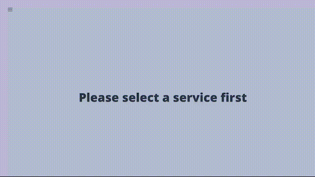

# RestUI

[](https://circleci.com/gh/MaethorNaur/restui)
[](https://codecov.io/gh/MaethorNaur/restui)
[](https://www.codefactor.io/repository/github/maethornaur/restui)

RestUI is intended to be a centralised UI for all your **OpenApi Specification** files.

RestUI is an autonomous server, which discovers your **OpenAPI Spec** for you.

Currently, RestUI can discover your API descriptions through `Docker`, `Kubernetes`, `Git`/`Github`

## Overview



## Build

### Requirements

- JDK 11+
- NodeJS/Npm: Front the react application

### React application

#### There are two ways to build it:

#### 1. Using SBT

```sh
sbt ";project rest-ui; npmInstall; webpackDevTask"
```

`webpackDevTask` can be replaced by `webpackProdTask` if you want to produce minified assets.

#### 2. Using NodeJS

```sh
cd rest-ui
npm install
npm run build
```

`npm run build` can be replaced by `npm run prod` if you want to produce minified assets.

### RestUI

Once the React application build you can generate the package for RestUI

```sh
sbt "project rest-ui; packageBin"
```

This will produce a zip located: `rest-ui/target/universal/rest-ui-{VERSION}-SNAPSHOT.zip`

You also can use `docker:publishLocal` instead of `packageBin` if you want directly to produce a docker image

## Usage

This project is targeted for Java 11+ in order

### Configuration

RestUI uses a HOCON format for its configuration.

Here is the default configuration used by RestUI.
```hocon
restui {
  // List of active providers
  // By default all available providers are activated
  // You can activate the the providers you want by overriding this field
  providers = [
    "restui.providers.git.GitProvider",
    "restui.providers.docker.DockerProvider",
    "restui.providers.kubernetes.KubernetesProvider"
  ]

  http {
    port = 8080 // Port of the Webserver
    interface = "0.0.0.0" // Interface where the webserver listen to
  }

  // Configuration for the docker provider
  // More information about how this provider works in the Docker provider section
  provider.docker {
    host =  "unix:///var/run/docker.sock" // Docker host

    // Labels name use to detect RestUI compatible container
    labels {
      port  = "restui.specification.endpoint.port" // Label specifying the port on which the OpenApi spec is available.
      service-name = "restui.specification.endpoint.service-name" // Label specifying the service name for RestUI.
      specification-path = "restui.specification.endpoint.specification-path" // Label of the path where the OpenApi spec file is.
    }

  }

  // Configuration for the Kubernetes provider
  // More information about how this provider works in the Kubernetes provider section
  provider.kubernetes {
    polling-interval = "1 minute" // Interval between each polling

    labels {
      port  = "restui.specification.endpoint.port" // Label specifying the port on which the OpenApi spec is available.
      protocol = "restui.specification.endpoint.protocol" // Label specifying which protocol the OpenApi spec is exposed.
      specification-path = "restui.specification.endpoint.specification-path" // Label of the path where the OpenApi spec file is.
    }
  }

  // Configuration for the git provider
  // More information about how this provider works in the Git provider section
  provider.git {
    cache-duration = "2 hours" // Interval between each clone....
    vcs {
      // Specific to Github
      github {
        api-token = "" // Github personal token.
        api-uri = "https://api.github.com/graphql" // Github GraphQL url.
        polling-interval = "1 hour" // Interval between each polling.
        repositories = [] // List of repositories.
      }
      git {
        repositories = [] // List of repositories
      }
    }
  }

}
```

To override the default values you can either create your configuration file
_(with only the fields you want to override)_, or pass parameter fields through system properties:

It is also possible to combine the configuration file and system properties at the time, but
in that case, the system properties values will **prevail**.

Example:

1. Pass a configuration file to system properties
```sh
rest-ui my-config.conf
```
2. Pass parameter fields and override the values to system properties:
```sh
rest-ui -Drestui.providers.0=Provider1, -Drestui.providers.1=Provider2, ...
```

## Providers

### Docker provider

The docker provider list and detect all running containers in real time.

A compatible container **MUST** include the following labels:

- A label specifying the service's name `restui.specification.endpoint.service-name`
- A label specifying the port where the OpenApi spec lays `restui.specification.endpoint.port`

Optional labels:

- A label specifying the path where the OpenApi spec lays `restui.specification.endpoint.specification-path`.
  
  Default path: `/specification.yaml`

Example:

```sh
docker  run --rm -l "restui.specification.endpoint.port=80" -l "restui.specification.endpoint.service-name=nginx" -v $(pwd):/usr/share/nginx/html:ro nginx:alpine
```

------------------------------------------------------------------------------------------------

### Kubernetes provider

In order to discover **OpenApi Specs** with RestUI in Kubernetes, the service **MUST** run inside the same Kubernetes
cluster of your services.

The Kubernetes provider list and detect all running services in real time.

New services are detected by polling from Kubernetes API at a regular interval.
The value for the interval is defined by `polling-interval` which default to `1 minute`.

A compatible service **MUST** have the following labels on it:

- A label specifying the protocol `restui.specification.endpoint.protocol`
- A label specifying the port where the OpenApi spec lays `restui.specification.endpoint.port`

Optional labels:

- A label specifying the path where the OpenApi spec lays `restui.specification.endpoint.specification-path`.
  
  Default path is: `/specification.yaml`

Also the services **MUST** have a `ClusterIP` (the provider will infer the address from the `ClusterIP`)

Example:

```yaml
apiVersion: v1
kind: Service
metadata:
  labels:
    restui.specification.endpoint.port: "80"
    restui.specification.endpoint.protocol: http
  name: specification
  namespace: default
spec:
  clusterIP: 10.96.0.2
  ports:
  - name: 80tcp02
    port: 80
    protocol: TCP
    targetPort: 80
  selector:
    selector: deployment
  sessionAffinity: None
  type: ClusterIP
status:
  loadBalancer: {}
---
apiVersion: apps/v1
kind: Deployment
metadata:
  labels:
    selector: deployment
  name: openapi
  namespace: default
spec:
  progressDeadlineSeconds: 600
  replicas: 1
  revisionHistoryLimit: 10
  selector:
    matchLabels:
      selector: deployment
  strategy:
    rollingUpdate:
      maxSurge: 1
      maxUnavailable: 0
    type: RollingUpdate
  template:
    metadata:
      labels:
        selector: deployment
    spec:
      containers:
      - image: nginx:alpine
        imagePullPolicy: Always
        name: openapi
        ports:
        - containerPort: 80
          name: 80tcp02
          protocol: TCP
        resources: {}
        securityContext:
          allowPrivilegeEscalation: false
          capabilities: {}
          privileged: false
          readOnlyRootFilesystem: false
          runAsNonRoot: false
        stdin: true
        terminationMessagePath: /dev/termination-log
        terminationMessagePolicy: File
        tty: true
      dnsPolicy: ClusterFirst
      restartPolicy: Always
      schedulerName: default-scheduler
      securityContext: {}
      terminationGracePeriodSeconds: 30
```

------------------------------------------------------------------------------------------------

### Git provider

The git provider can be used to clone git repositories at a regular interval (`cache-duration`).
You can either provide the list of repositories you to clone or use Github to discover repositories.

It's possible to use both options at the same time.

Each option requires a list of `repositories`. This list can be either a **string** corresponding to
the full url (`organization/project` for Github) or on an object.

The object follows this schema:

```hocon
{
  location = "" // Full url, `organization/project` for Github
                // or a regex (the string **MUST** starts and ends with `/`)
  branch = "" // Branch to clone (default to `master` or inferred from the default branch in Github)
  specification-paths = [] // List of OpenApi spec files or directories containing those kind of files
                     // inside your repository. Those paths are overrided by the restui configuration file inside
                     // of your repository.
}
```

If the repository contains a file at the root level called `.restui.yaml` then Git provider will
read the OpenApi spec files specified in that file.

Example:

`.restui.yaml`
```yaml
name: "Test"
specifications:
  - "foo-service.yaml"
  - "/openapi/bar-service.yaml"
```

YAML
# Service's name.
# If this field does not provide the service name will be inferred from the repository URL
# Example: "https://github.com/MyOrg/MyRepo" -> "MyOrg/MyOrg"
name = "service name"
# List of OpenApi spec files or directories
specifications = []
```

If you intend to use the Github option you need to provide a token.
This token can be generated [here](https://github.com/settings/tokens/new).
You will need to allow:

- `public_repo` if you want to list public repositories
- `repo`: if want to list public and private repositories

### Docker

```sh
docker pull maethornaur/rest-ui

docker run -p 8080:8080 maethornaur/rest-ui

```

Options can either be passed as an environment variable or as a parameter.

To override the default value for a configuration entry (found in the
`reference.conf` files) just pass the `HOCON` path preceded by `-D`

```sh
docker run -p 8081:8081 maethornaur/rest-ui -Drestui.http.port=8081
```

There is a special case for configuration fields that are arrays.
You need to append the path by the index:
`restui.providers.0=restui.servicediscovery.docker.DockerProvider`

If you prefer you can use an environment variable instead.
For that take the path, uppercase it and replace the `.` by `_` and `-` by `__`.

```sh
docker run -p 8081:8081 -e RESTUI_HTTP_PORT=8081 maethornaur/rest-ui
```
