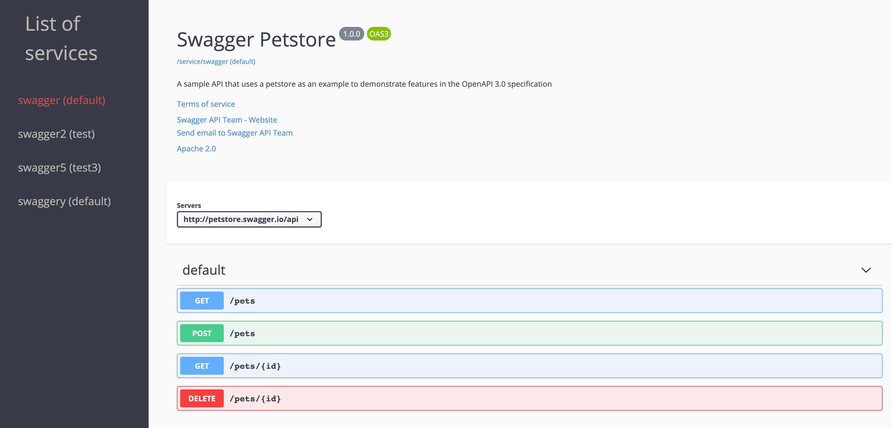

# RestUI

[](https://circleci.com/gh/MaethorNaur/restui)
[](https://codecov.io/gh/MaethorNaur/restui)
[](https://www.codefactor.io/repository/github/maethornaur/restui)

RestUI is a dynamic UI for **Swagger** REST definitions.

RestUI will discover automatically new services and expose the documentation
under one unified website.

Currently it can discover services through `Docker` and `Kubernetes` (inside the cluster)

## Overview



## Usage

This project is targeted for Java 11+ in order

### Docker

```sh
docker pull maethornaur/rest-ui

docker run -p 8080:8080 maethornaur/rest-ui

```

Options can either be passed as an environment variable or as parameter.

To override the default value for a configuration entry (found in the
`reference.conf` files) just pass the `HOCON` path preceded by `-D`

```sh
docker run -p 8081:8081 maethornaur/rest-ui -Drestui.http.port=8081
```

There is a special case for configuration fields that are arrays.
You need to append the path by the index:
`restui.providers.0=restui.servicediscovery.docker.DockerProvider`

If you prefere you can use environment variable instead.
For that take the path, uppercase it and replace th `.` by `_` and `-` by `__`.

```sh
docker run -p 8081:8081 -e RESTUI_HTTP_PORT=8081 maethornaur/rest-ui
```
